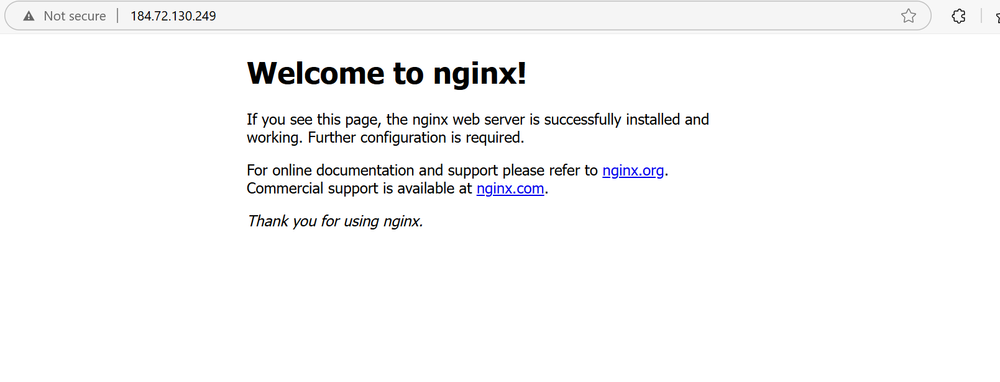

# **Project Title: Automating Custom AMI Creation with Packer and Deploying with Terraform**

---

## **Project Objectives**

- To create a custom Amazon Machine Image (AMI) with **Nginx** pre-installed using **Packer**.
- To automate the deployment of an EC2 instance from the custom AMI using **Terraform**.
- To understand the basic principles of Infrastructure as Code (IaC).
- To practice using AWS services securely and efficiently.
- To demonstrate hands-on skills with Packer and Terraform.

---

## **Implementation Steps**

### **Step 1: Install Prerequisites**

- Install [Packer](https://www.packer.io/downloads) and [Terraform](https://developer.hashicorp.com/terraform/downloads) on your local machine.

- Ensure you have an [AWS Account](https://aws.amazon.com/free/) and set up your AWS CLI credentials locally.

### **Step 2: Create Packer Template**

- Write a `nginx-ami.json` file that defines:
  - AWS Region
  - Base Source AMI (e.g., Amazon Linux 2)
  - Provisioners to install and start Nginx.

```bash
# Example command to build the AMI
packer build nginx-ami.json
```

- Output: A custom AMI with Nginx installed.

> 

---

### **Step 3: Find the Custom AMI ID**

- Go to AWS Management Console → EC2 → AMIs.
- Set the filter to **Owned by me**.
- Copy the **AMI ID** generated by Packer.

> 

---

### **Step 4: Create Terraform Configuration**

- Write a `main.tf` file to:
  - Launch an EC2 instance using the custom AMI ID.
  - Create a security group allowing HTTP traffic (port 80).

```bash
# Example command to initialize Terraform
terraform init

# Example command to apply the configuration
terraform apply -var="ami_id=<your-ami-id>" -var="key_name=<your-key-name>"
```

> 

---

### **Step 5: Verify Deployment**

- Go to EC2 Dashboard → Instances.
- Find the running instance.
- Copy the Public IP address.
- Visit `http://<Public-IP>` in your browser.
- You should see the default **Nginx Welcome Page**!

> 

---

## **Conclusion**

- I Successfully automated the creation of a custom AMI using Packer.
- I Successfully provisioned an EC2 instance from the AMI using Terraform.
- I Gained practical experience in managing infrastructure as code.

---

# **Folder Structure**

```
terrapack/
│
├── packer/
│   └── nginx-ami.json
│
├── terraform/
│   └── main.tf
│
├── Images/
│   └── (My project screenshots)
```
